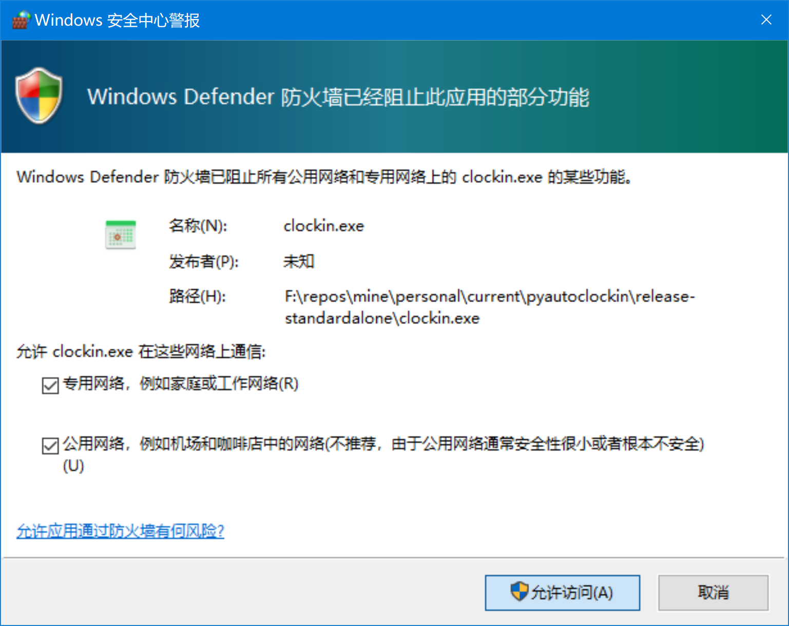

# 山东大学自动疫情打卡程序

---
## Disclaimer
### THIS SOFTWARE IS PROVIDED "AS-IS" , WITHOUT ANY EXPRESSED OR IMPLIED WARRANTY .USE IT AT YOUR OWN RISK !
---

这是一个用python编写的自动打卡程序，使用selenium框架。
> Made by a sdu(wh) student for sdu/wh students.

## 下载

参见 Release 界面

## 使用方法

### Windows Exe 版本

> 注意 : 
> nochrome版本需要自己手动指定chrome路径.
> 
> 请在`settings.json`文件中添加一条
> `"chrome":"到你的chrome.exe的路径(请勿忘记转义)"`

在程序目录下新建users.json , 按下文的格式输入学生信息!

双击运行`clockin.exe`

如有下图的警示, 请允许程序通过防火墙


程序执行过程中没有异常即打卡成功

建议配合[AutoSdu](https://github.com/kxxt/AutoSdu)使用 , 可以方便的获得打卡截图转发到QQ群

### Python 脚本

将信息写入users.json,按以下格式:

```json
[
    {
        "username":"学号",
        "password":"密码",
        "left":true,
        "province":"省",
        "city":"市",
        "district":"区",
        "address":"详细地址"
    },
    {
        "username":"学号",
        "password":"密码",
        "left":true,
        "province":"省",
        "city":"市",
        "district":"区",
        "address":"详细地址"
    }
]
```

- left 属性表示是离校生还是留校生

```bash
pip3 install selenium
python3 clockin.py
```

如无错误则打卡成功

## 可选参数

打开`settings.json`可以修改以下几个参数。

- `retrymax` : 为最大重试次数
- `print2con` : 为是否打印到控制台
- `silent` : 为是否静默运行 , 若要在服务器上运行请把此项设置为`true`
- `chrome` : 自己指定Chrome浏览器路径 , 常用于Windows下
- `logsucceeded` : 将成功打卡的记录也进行Log
- `save_path`: 截图保存位置 (功能开发中)

## 在服务器上的配置

### Serverside

- 服务器需要具备`python3`,`chrome`,`pip3 install selenium`.
- 如果需要配置打卡截图服务则需要安装至少一个中文字体.
- 设置`settings.json`中`silent`为`true`,`save_path`为保存打卡截图的文件夹
- `settings.json`中其他参数按需修改
- 填写`users.json`
- 赋予chromedriver执行权限, `chmod +x chromedriver`
- 设置保存打卡截图文件夹的权限 , 确保程序可以写入 , Web浏览器上可以打开此文件夹内的文件.
- 设置cornjob, 定时执行打卡任务
  
### Clientside

- 下载[AutoSdu](https://github.com/kxxt/AutoSdu)
- 设置 `URL` 为到服务器截图文件夹的网址
- 设置用户名为学号

## 应用场景

- 在电脑上手动运行来一键打卡
- 在电脑上设置定时任务打卡(在手机上不太好办)
- 部署到云服务器上自动定时打卡
- 修改程序给sdu所有人打一遍卡（危）（手动滑稽）

## 打赏

给开发者投食：)


